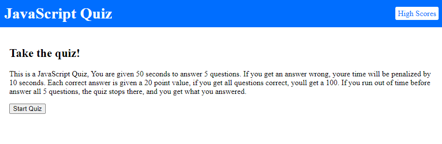

# JavaScriptQuiz

## Description

This is a JavaScript Quiz, You are given 50 seconds to answer 5 questions. If you get an answer wrong, youre time will be penalized by 10 seconds. Each correct answer is given a 20 point value, if you get all questions correct, youll get a 100. If you run out of time before answer all 5 questions, the quiz stops there, and you get what you answered.

## Links
[GitHub](https://github.com/jcha25/JavaScriptQuiz)\
[Live](https://jcha25.github.io/JavaScriptQuiz/)

## Screenshot

